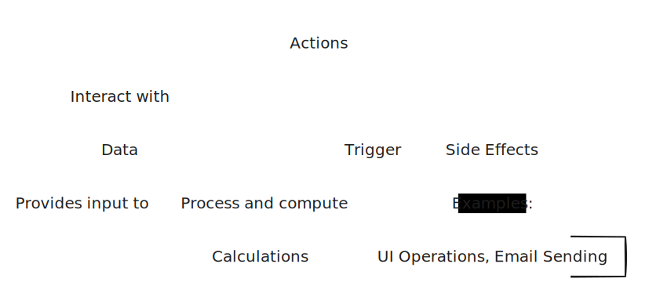

# 第一章

### 什麼是函數式程式設計(Functional Programming)

* 使用數學函數
* 避免side effects(副作用)
  * side effects是指除了傳回值以外的函數行為，如：寄送電子郵件、修改全域變數、讀寫檔案...等
* 只使用純函數(pure function) - 無side effects的函數
  * pure function是指輸出完全由引數決定，且完全沒有side effects的函數

### FP經典定義在實務中的問題

* 無法避免side effects
  * side effects往往是軟體的核心主軸，如：畫面操作、寄送電子郵件...等
* FP不僅僅是理論

### 區分Actions、Calculations、Data

* Actions(動作、操作或行為)
  * 函式的執行會受到各種因素產生變化，相同引數可能會導致不同結果
  * 充滿side effects
* Calculations(計算、運算)
  * 函式執行僅受到引數影響，同樣的引數不論執行多少次，結果必定相同
  * 能夠簡單測試並驗證結果
* Data(資料、數據)
  * 用來記錄各種資料與數據



```javascript
{"_id" : "A123456789", "_name" : "Test"} // Data
sendEmail(to, from, subject, body); // Actions
sum(a, b); // Calculations
saveUserDB(user); // Actions
strlength(str) // Calculations
getCurrentTime(); // Actions
[1,2,3,4] // Data
```
